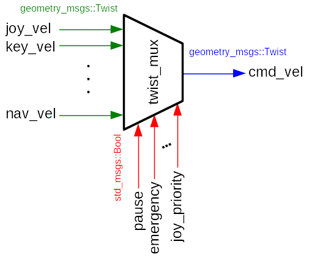

# 🤖 로봇 이동 제어: twist_mux 활용 가이드

로봇을 원하는 대로 정교하게 이동시키기 위해, 우리는 /cmd_vel 토픽을 통해 로봇의 **선속도(linear velocity)**와 **각속도(angular velocity)**를 발행합니다. 이 /cmd_vel 메시지는 로봇에게 "지금 어느 방향으로 얼마나 빨리 가고, 얼마나 빠르게 회전해야 하는지"를 지시합니다.

## 🚦 twist_mux 사용 이유: 제어 명령의 충돌 방지

mini pi 로봇의 움직임을 관리하는 /sim2real_master_node는 /cmd_vel을 받아 관절 움직임으로 변환합니다.

### 🎯 다중 소스 제어의 문제점

기존에는 /cmd_vel이 조이스틱에서만 발행되었지만, 이제는 카메라 기반 장애물 회피와 같은 자율 기능에서도 이 토픽을 발행해야 합니다.

충돌 문제: 하나의 토픽(/cmd_vel)에 조이스틱 노드와 자율 주행 노드가 동시에 서로 다른 속도 명령을 발행하면, 로봇은 어떤 값을 따라야 할지 혼란을 겪게 되어 움직임이 이상해지거나 버벅거리게 됩니다.

표준화 문제: /cmd_vel은 mini pi뿐만 아니라 다른 다양한 로봇들의 이동에 사용되는 ROS 표준 토픽입니다. mini pi만을 위해 다른 메시지 형식을 지정하는 것은 재사용성과 확장성 측면에서 적합하지 않습니다.

### 💡 twist mux의 역할

이러한 문제를 해결하기 위해 twist_mux (Twist Multiplexer)를 사용합니다. twist mux는 여러 소스(조이스틱, 자율 주행, 키보드 등)에서 들어오는 cmd_vel 명령 중 상황에 따라 적절한 하나의 명령을 선택하여 로봇에게 전달합니다. 이를 통해 명령 충돌 없이 로봇을 제어할 수 있습니다.

twist mux는 우선순위(priority)와 타임아웃(timeout) 설정을 통해 여러 동작 제어 중 가장 적합한 하나를 선택하여 최종 /cmd_vel로 발행하게 됩니다.




## 📝 토픽 발행 실습: twist_mux 전후 비교

다음은 /cmd_vel 토픽을 발행하여 로봇을 이동시키는 실습입니다.

1. twist mux를 사용하지 않을 때 (충돌 발생)

아래 코드를 입력하고 실행을 해보면, 기존 조이스틱만으로 이동할 때 보다 소음이 많고, 버벅거리는 것을 확인할 수 있습니다.
```python
# /home/hightorque/soccer_ws/twist_mux_lab.py

import rospy
from geometry_msgs.msg import Twist

class MiniPiGo:
    def __init__(self):
        rospy.init_node('mini_pi_controller', anonymous=True)

        self.pub=rospy.Publisher("/cmd_vel", Twist, queue_size=10)
        self.cmd_vel=Twist()

        self.cmd_vel.linear.x = 0.5

        rospy.Timer(rospy.Duration(0.1), self.go_forward) 
    
    def go_forward(self, event=None):
        self.pub.publish(self.cmd_vel)

if __name__ == "__main__":
    node=MiniPiGo()
    rospy.spin()

```


이를 실행하기 위해서는, 확인할 것이 한 가지 있습니다.

sim2real_master/install/share/sim2real_master/joy_footstep.yaml에서 

```yaml
# sim2real_master/install/share/sim2real_master/joy_footstep.yaml

teleop:
  walk:
    type: topic
    message_type: geometry_msgs/Twist
    topic_name: cmd_vel/joy
    ...

```
위 부분의 topic_name이 **cmd_vel**인지 확인하여 주세요.

이후 아래 명령어를 터미널에 입력해주세요.

```bash
python3 /home/hightorque/soccer_ws/twist_mux_lab.py
```

2. twist mux를 사용하여 로봇 이동시키기

동일한 코드를 사용합니다. 하지만, publish에서 차이가 있습니다.
```python
# /home/hightorque/soccer_ws/twist_mux_lab.py

import rospy
from geometry_msgs.msg import Twist

class MiniPiGo:
    def __init__(self):
        rospy.init_node('mini_pi_controller', anonymous=True)

        self.pub=rospy.Publisher("/cmd_vel/lab", Twist, queue_size=10)
        self.cmd_vel=Twist()

        self.cmd_vel.linear.x = 0.5

        rospy.Timer(rospy.Duration(0.1), self.go_forward) 
    
    def go_forward(self, event=None):
        self.pub.publish(self.cmd_vel)

if __name__ == "__main__":
    node=MiniPiGo()
    rospy.spin()
```

sim2real_master/install/share/sim2real_master/joy_footstep.yaml에서 

```yaml
# sim2real_master/install/share/sim2real_master/joy_footstep.yaml

teleop:
  walk:
    type: topic
    message_type: geometry_msgs/Twist
    topic_name: cmd_vel/joy
    ...

```
위 부분의 topic_name이 **cmd_vel/joy**인지 확인하여 주세요.

이후, soccer_ws/src/wego_twist_mux/config/twist_mux_lab.yaml에서 아래와 같이 설정되었는지 확인하세요.
```yaml
# soccer_ws/src/wego_twist_mux/config/twist_mux_lab.yaml

topics:
  - name: joystick
    topic: /cmd_vel/joy # 조이스틱
    timeout: 0.15
    priority: 80

  - name: lab
    topic: /cmd_vel/lab # 조이스틱
    timeout: 0.15
    priority: 90


locks:
  - name: estop
    topic: /twist_mux/lock   # std_msgs/Bool
    timeout: 0.0             # 잠금은 타임아웃 없음
    priority: 255            # 최상위 = 잠기면 무조건 정지 유지
```

아래 명령어들을 터미널에 각각 입력해주세요

```bash
$ roslaunch wego_twist_mux twist_mux_lab.launch
```

```bash
$ python3 /home/hightorque/soccer_ws/twist_mux_lab.py
```

훨씬 자연스럽게 움직이는 것을 확인할 수 있습니다.

## ⌨️ 실습: 터미널에서 키보드로 로봇 이동시키기

아래 teleop_key.py 코드를 실행해주세요.
```Python
# /home/hightorque/soccer_ws/teleop_key.py

import rospy
from geometry_msgs.msg import Twist
import sys, select, termios, tty

def get_key_non_blocking():
    """키보드에서 문자를 입력받되, 기다리지 않습니다."""
    # sys.stdin을 읽을 준비가 되었는지 0초 동안 확인
    # (즉, 블로킹 없이 바로 확인)
    if select.select([sys.stdin], [], [], 0.0)[0]:
        return sys.stdin.read(1)
    return None

class MiniPiTeleop:
    def __init__(self):
        rospy.init_node('mini_pi_keyboard_controller', anonymous=True)
        
        self.pub = rospy.Publisher("/cmd_vel/lab", Twist, queue_size=10)
        self.cmd_vel = Twist()

        self.rate = rospy.Rate(10)
        
    def run(self):
        settings = termios.tcgetattr(sys.stdin)

        print("=======================================")
        print("W: Forward (+0.5 m/s)")
        print("S: Backward (-0.5 m/s)")
        print("A: Turn Left (+0.3 rad/s)")
        print("D: Turn Right (-0.3 rad/s)")
        print("Any other key or no key: STOP")
        print("P: Quit")
        print("=======================================")

        try:
            # 터미널 설정을 즉시 입력받는 모드로 변경 (Enter 불필요)
            tty.setraw(sys.stdin.fileno())
            
            while not rospy.is_shutdown():
                key = get_key_non_blocking()
                
                # 매 루프마다 속도 초기화
                self.cmd_vel.linear.x = 0.0
                self.cmd_vel.angular.z = 0.0
                
                if key == 'w':      # 앞
                    self.cmd_vel.linear.x = 0.3
                elif key == 's':    # 뒤
                    self.cmd_vel.linear.x = -0.3
                elif key == 'a':    # 좌회전
                    self.cmd_vel.angular.z = 0.4
                elif key == 'd':    # 우회전
                    self.cmd_vel.angular.z = -0.4
                elif key == 'p':    # 종료
                    rospy.loginfo("Quit Teleoperation.")
                    break
                
                self.pub.publish(self.cmd_vel)
                
                self.rate.sleep()

        except Exception as e:
            rospy.logerr(f"An error occurred: {e}")
        
        finally:
            self.cmd_vel.linear.x = 0
            self.cmd_vel.angular.z = 0
            self.pub.publish(self.cmd_vel)

            termios.tcsetattr(sys.stdin, termios.TCSADRAIN, settings)

if __name__ == "__main__":
    node = MiniPiTeleop()
    node.run()
```

아래 명령어들을 터미널에 각각 입력해주세요.


```bash
$ roslaunch wego_twist_mux twist_mux_lab.launch
```

```Bash
$ python3 /home/hightorque/soccer_ws/teleop_key.py
```

w, s로 앞/뒤 선속도를, a, d로 좌/우 회전 각속도를 실행할 수 있습니다.