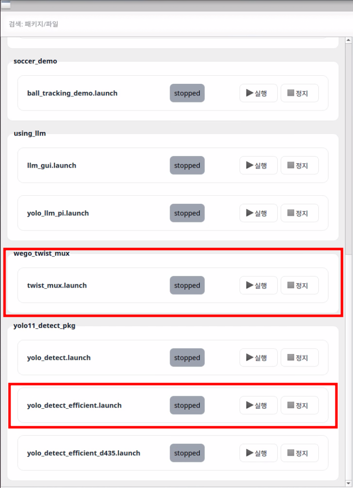
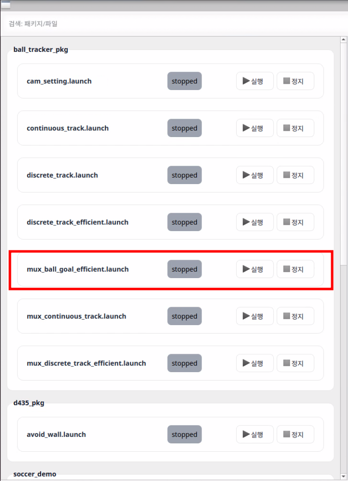

# 데모 실행 매뉴얼
## 공 차기

### 바로 사용하기 (nomachine을 이용한 GUI)
새 터미널을 켜거나, 기존 터미널에서 `source ~/.bashrc`를 입력하면 아래 사진과 같이 단축어가 나옵니다.

차례대로 `soccer_ws`, `roboworld_gui`를 입력하면 GUI 창이 나타납니다.

아래처럼 표시된 항목을 재생하십시오.

### 바로 사용하기 (웹 GUI 접속)
