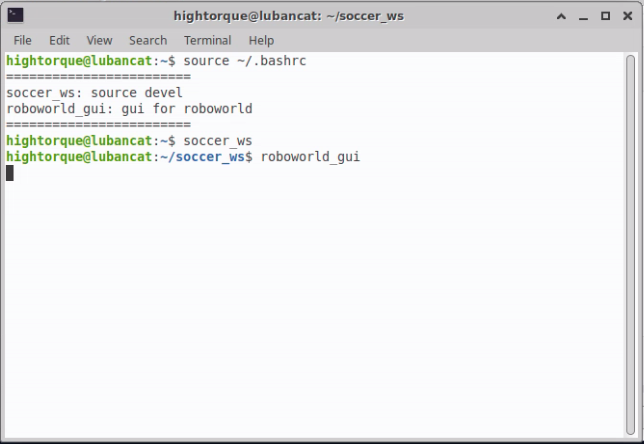
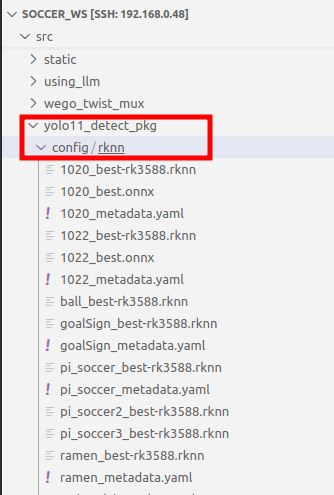
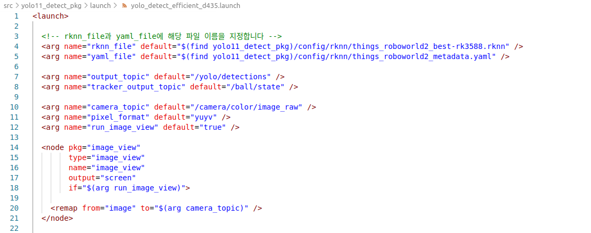

# 데모 실행 매뉴얼
## 공 추적하기

### 바로 사용하기 (nomachine을 이용한 GUI)
새 터미널을 켜거나, 기존 터미널에서 `source ~/.bashrc`를 입력하면 아래 사진과 같이 단축어가 나옵니다.


차례대로 `soccer_ws`, `roboworld_gui`를 입력하세요.



아래와 같이 GUI 창이 나타납니다.


아래처럼 표시된 항목을 재생하십시오.

twist_mux는 조이스틱, 기타 코드 등에서 내보내는 로봇 조종 명령 간 우선순위를 결정합니다.


avoid_wall은 근처의 벽이나 장애물을 마주쳤을 때 회전하도록 하며, mux_discrete_track_efficient가 공을 추적하도록 합니다.


### 바로 사용하기 (웹 GUI 접속)
기본적으로, 로봇을 켜거나 다시 로그인 할 때 자동으로 웹 GUI에 접속 할 수 있는 설정이 완료됩니다.

위에서와 같은 항목을 재생하십시오.


---
## 커스텀환경에서 공 추적하기
mini pi는 rk3588기반 npu가 지원됩니다. 따라서 yolo학습 이후 나오는 .pt 파일을 .rknn 파일로 바꾸어 적용할 수 있습니다.

기존 mini pi에서 제공되는 공 추적 알고리즘에서 공이 제대로 검출되지 않는다면 사용 환경에서 새로 학습을 수행할 수 있습니다.

단계는 다음과 같습니다.
1. 공 데이터셋 수집
2. YOLO 학습
3. 학습된 YOLO pt 모델 rknn 변환
4. rknn을 공 추적 launch 파일에 지정

#### 1. 공 데이터셋 수집
조종을 하기 위해서 위의 twist_mux.launch를 실행해줍니다.

아래 명령어를 입력합니다. 기본적으로 /usb_cam/image_raw 토픽을 실행하도록 되어있으며, 해당토픽을 실행하기 위한 명령어도 자동으로 수행됩니다.
bag_prefix를 통해 저장할 bag파일 이름을 정할 수 있습니다. 정하지 않을 경우, 자동으로 img_dataset으로 지정되며, 이전에 같은 이름이 있을 경우 덮어씌워집니다.
```bash
$ roslaunch dataset_making record_bag.launch bag_prefix:=(저장할 파일 이름)
```

이 명령어를 수행한 후, 직접 로봇을 움직이면 자동으로 이미지 토픽들이 .bag 파일에 저장됩니다.
ctrl+c를 통해 녹화를 끝내면 /home/hightorque/soccer_ws/src/dataset_making/bags에 "bag_prefix".bag 으로 bag 파일이 저장됩니다. 

이후, 아래 명령어를 통해 bag파일로부터 이미지를 추출하여 저장합니다. bag_filename에는 이미지로 추출할 bag파일의 전체 경로를 넣어주세요.
```bash
$ roslaunch dataset_making get_image.launch bag_filename:=/home/hightorque/soccer_ws/src/dataset_making/bags/(bag파일 이름).bag
```

#### 2. YOLO 학습
추출된 이미지를 라벨링하여 yolo로 학습합니다.
라벨링하는 프로그램은 다양하지만, roboflow를 추천합니다.
https://roboflow.com/

yolo 학습은 아래 링크를 참고해주세요.
https://docs.ultralytics.com/quickstart/#use-ultralytics-with-cli

#### 3. 학습된 YOLO pt 모델 rknn 변환
YOLO를 학습한 이후, best.pt 와 같이 모델이 나옵니다. rk3588에서 사용할 수 있는 rknn 변환을 지원하므로, 이를 사용하면 yolo 라이브러리 설치 없이 간단하게 사용할 수 있습니다.

https://docs.ultralytics.com/ko/integrations/rockchip-rknn/#summary

```bash
$ yolo export model=(변경할 pt 모델) format=rknn
```
이후, .rknn과 모델의 정보가 든 metadata.yaml이 생성됩니다.

#### rknn을 공 추적 launch 파일에 지정
생성된 .rknn과 metadata.yaml을 공 추적에 사용되는 launch 파일에 저장합니다.

아래 사진과 같이 soccer_ws/src/yolo11_detect_pkg/config/rknn에 저장합니다.



이후, yolo11_detect_pkg의 yolo_detect_efficient_d435.launch에서 rknn_file과 yaml_file의 기본 경로를 변경합니다.

