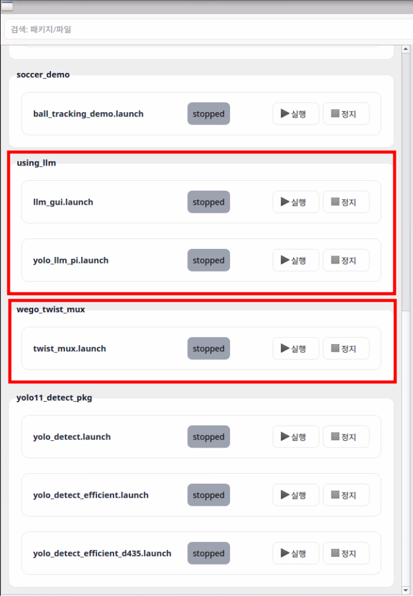
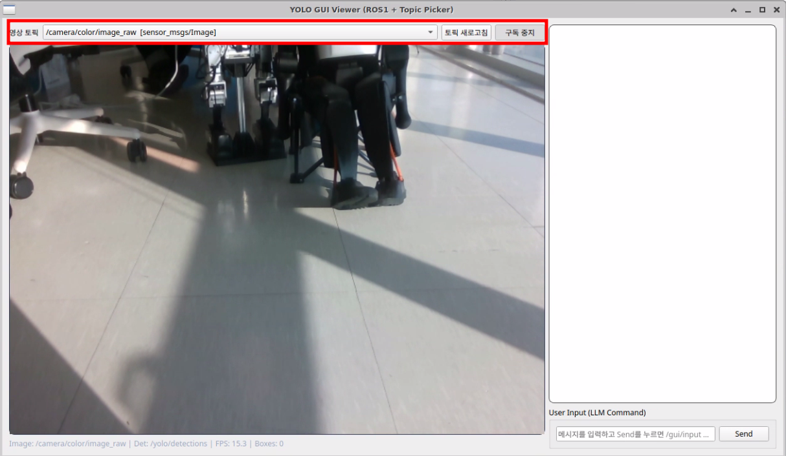
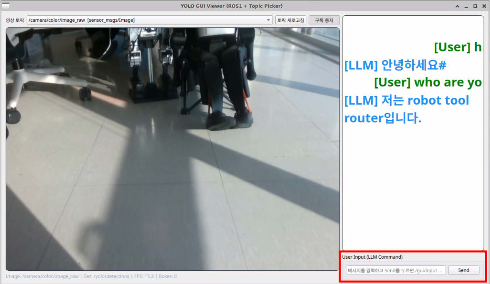

# 데모 실행 매뉴얼
## LLM을 통하여 물건 찾기

### 바로 사용하기 (nomachine을 이용한 GUI)
새 터미널을 켜거나, 기존 터미널에서 `source ~/.bashrc`를 입력하면 아래 사진과 같이 단축어가 나옵니다.

차례대로 `soccer_ws`, `roboworld_gui`를 입력하면 GUI 창이 나타납니다.

아래처럼 표시된 항목을 재생하십시오.

다음과 같이 llm 기반 채팅을 할 수 있는 gui가 나타납니다.

이미지 토픽을 선택하고 영상을 확인할 수 있습니다.

위와 같이 사용자의 입력에 따라 LLM이 답변을 합니다. 답변 출력까지 5~10초 간의 시간이 발생할 수 있습니다.

### 바로 사용하기 (웹 GUI 접속)
