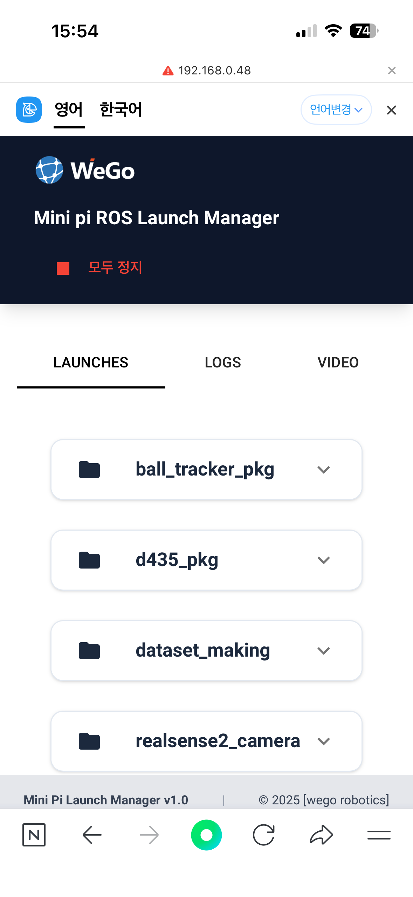
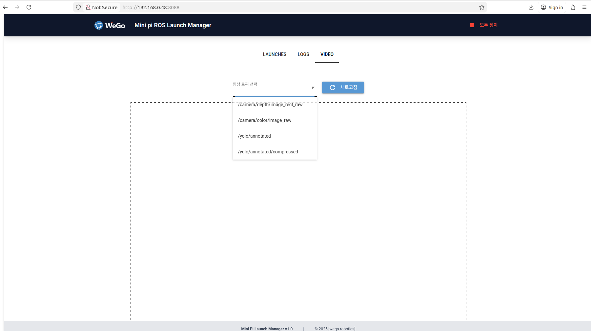

# web GUI 사용 매뉴얼

nomachine이나 HDMI, ssh 접속 없이 같은 네트워크를 사용한다면 웹 주소 접근을 통해 mini pi를 제어할 수 있도록 하였습니다.

기본적으로 start up에 등록하여 로봇을 켜자마자 실행됩니다.

#### 사용 전 기초 작업
로봇을 사용하는 물리적인 환경이 다르기 때문에 네트워크 관련 설정을 초기에 해주어야 합니다.

(IP 설정, port 설정 방법 추가, startup, sh 파일 수정)

mini pi는 ros1으로 사용하여 rosbridge, roslibpy를 사용할 필요가 없지만, 향후 ros2를 사용할 때를 대비하여 ros버전에 관계 없이 사용하고자 한다.
향후 로봇에서 rosbridge를, 로봇 외의 pc에서 web gui를 구동할 수 있다.

#### GUI 메인

아래와 같이 GUI가 보인다면 접속에 성공한 것입니다.

화면 크기에 맞춰 적당한 크기로 설정하였기 때문에 모바일에서도 편하게 볼 수 있습니다.

  

#### 런치 리스트 보기
soccer_ws 내의 패키지들이 갖고 있는 런치파일들이 있습니다.
패키지 명을 클릭하시면 해당 패키지에서 실행할 수 있는 런치파일들이 나타납니다.

실행하고자하는 런치파일의 RUN 버튼을 누르면 런치파일이 실행되며, 버튼의 상태가 변합니다.
버튼을 한 번 더 누르면 런치파일의 실행이 중단됩니다.

 

#### 영상 보기
상단의 VIDEO 탭을 클릭하시면 영상을 볼 수 있는 페이지로 이동합니다.

'영상 토픽 선택' 드롭박스를 클릭하시면 현재 확인할 수 있는 영상 토픽들이 나타납니다.
**이 때, 원활한 영상 송출을 위해 /compressed 형식의 토픽을 재생하는 것을 추천합니다.**

아래와 같이 영상이 나옵니다.

#### LLM 기반 채팅

using_llm 패키지의 두 런치파일을 실행하십시오.
그 후, 주소창에 /LLM_chat을 추가하면 아래와 같이 채팅 페이지로 넘어갑니다.

